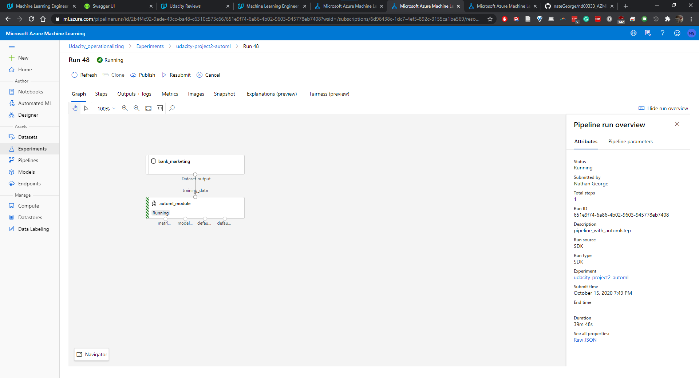

# ML Ops with Azure ML

In this project, we are using the Azure bank marketing dataset to predict if customers will sign up for a term deposit based on some characteristics of the customers.  We use AutoML to train a model, then deploy the model as a REST endpoint, and test that it's working.  We also create a pipeline to do the same thing.

This project could be improved by using a GPU and neural networks to try and get better accuracy.  It could also be scaled up to train faster with more computing power with a bigger cluster.

## Architectural Diagram
The steps for training a model and publishing an endpoint are:
- upload data to Azure
- train AutoML model on data
- deploy best model from AutoML to a REST endpoint

A diagram of this follows:

For the pipeline, we do the following with the Python SDK:
- load data to azure
- create cluster resources
- create experiment for training ML model
- attach data, cluster, and experiment to pipeline
- run pipeline (trains model)
- publish the API (creates the REST API endpoint)
- get the API endpoint and test functionality

## Key Steps

A service principal (SP) was created with the Azure ML CLI:

Next the SP was added as an owner to the ML workspace with the `share` command:

The bankmarketing dataset was uploaded to ML studio as a dataset:

An autoML run was completed classifying the 'y' column of that data:

We used the best model as our choice for deployment:

Next we deploy the best model:

We enalbed application insights (logging):

Next we run logs.py and enable logging, then get the current logs:

We then download swagger.json and examine the swagger docs in the swagger UI:

We test that endpoint.py works and we can access the API:

We create a pipeline:

with a pipeline endpoint that is active...

with the bankmarketing dataset and automl module...

The pipeline overview shows the REST endpoint:

The RunDetails widget through the Python SDK shows the step runs:

We can also schedule pipelines to run periodically with the SDK.  In ML studio, we can see the scheduled run:

In the end, we have an endpoint from our pipeline for our ML model.  This could auto-update based on changes in data or other files.

## Screen Recording
[Link to screencast](https://youtu.be/EhSvYmYSa7s)

